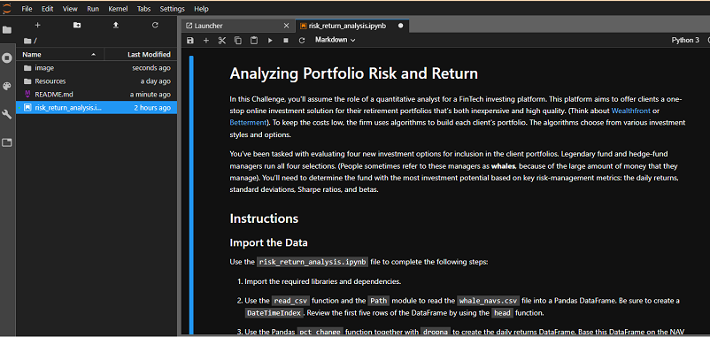

# RetireRich - a one-stop online investment solution for your retirement

RetireRich is a python based application to calculate and analyze the risk-return of funds as compared to the S&P 500 Index. The sample data used in this program has Net Asset Value (NAV) of four popular-and-big funds (SOROS FUND MANAGEMENT LLC, PAULSON & CO.INC., TIGER GLOBAL MANAGEMENT LLC, BERKSHIRE HATHAWAY INC) along with the S&P 500. The NAV acts as the daily closing price for the fund. The overall goal is to determine the fund with the most investment potential based on key risk-management metrics: the daily returns, standard deviations, Sharpe ratios, betas and rolling-window betas.

The program shows a step-by-step approach of evaluating the four new investment options (funds) for inclusion in the client portfolios. The program does a quantitative analysis using the several components: performance, volatility, risk, risk-return profile, and portfolio diversification.

---

## Technologies

This project leverages python 3.7.* with the following additional packages:
* [Jupyter Notebook](https://jupyter.org/) - The main module of the Crypto Arbitrage Calculator is written in Jupyter Notebook.
* [Conda](https://docs.conda.io/projects/conda/en/latest/) - Conda environment is recommended to have Pandas library and other dependencies pre-installed.

**Required Libraries:**

You may need the following libraries to work with the program.

- [Pandas](https://pandas.pydata.org/docs/reference/index.html) - pandas is a Python package providing fast, flexible, and expressive data structures designed to make working with “relational” or “labeled” data both easy and intuitive.
- [NumPy](https://numpy.org/doc/stable/user/absolute_beginners.html) - NumPy is the fundamental package for scientific computing in Python.

---

## Usage

To use the RetireRich application, clone the repository and run the **risk_return_analysis.ipynb** with Jupyter notebook.

From the Git Bash terminal, make sure to 'activate conda' and appropriate virtual enivorment. Next, launch the JupyterLab web-based interactive development environment (IDE) interface by typing at the prompt:

```python
  > jupyter lab
```

Then, browse to **risk_return_analysis.ipynb** starter code file to run the program. See the image below for a quick hint.



## Contributors

FinTech Labs, Inc.

---

## License

None